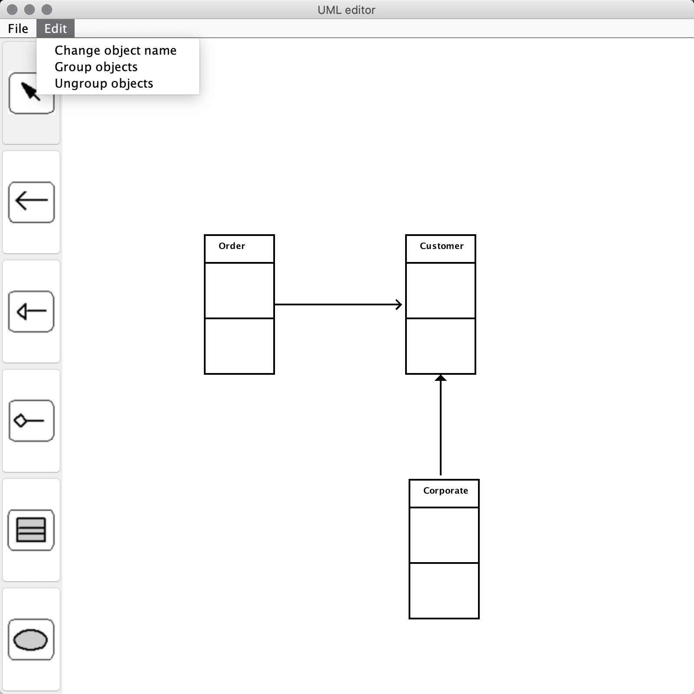
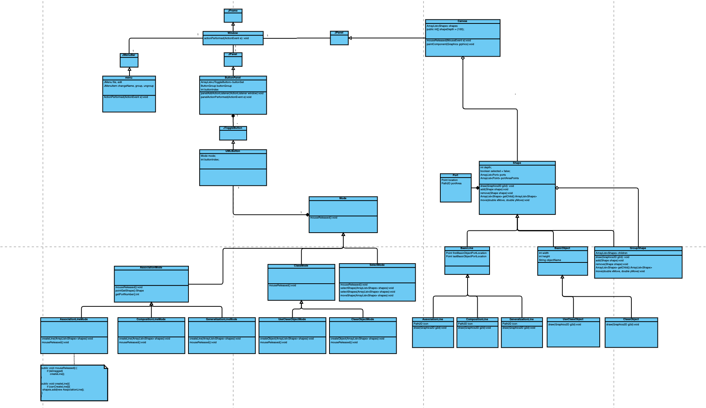
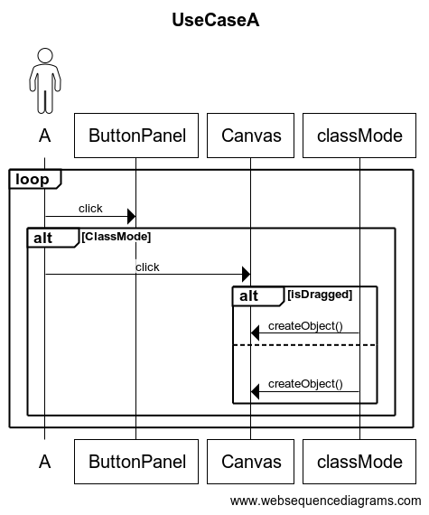
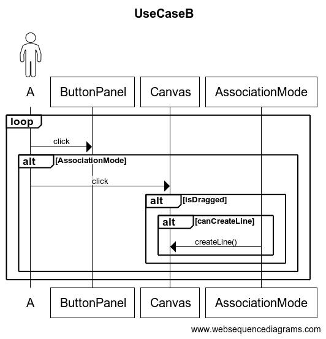
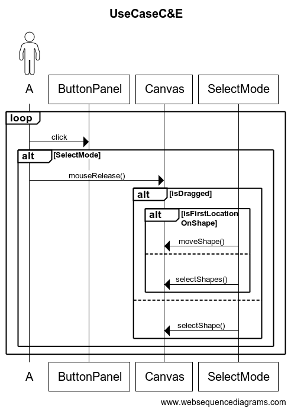
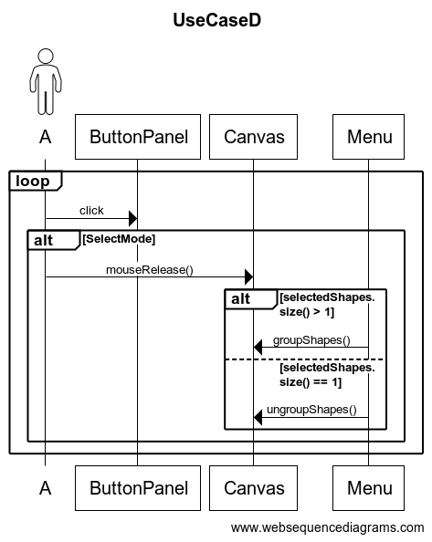
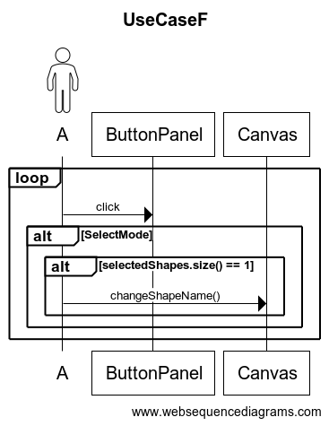

# **Unified Modeling Language (UML) editor** 
### ( the final project of Object-Oriented Analysis and Design in NCU CSIE )

## Description

A UML editor is a software application supporting the notation and semantics associated with the Unified Modeling Language (UML), which is the standard software blueprint language for analysts, designers, and programmers. Using UML editor to analyze the whole system with UML diagrams can prevent losing the sight of the forest for the trees and help developers communicate certain concepts clearly with other teammates.



***

## Features
+ **Class Mode**
  + Creating a UML object
    + press buttons (*Class Object*, *Use Case Object*)
    + click in the editor area to create objects
+ **Assciation Mode**
  + Creating a UML connection line
    + press buttons (*Association Line*, *Generalization Line*, *Composition Line*)
    + select one object as the start part of the line
    + drag the mouse continuously to the second object, which is the end part of the line
+ **Select Mode**
  + Select a single object
    + press *Select* button
    + click on the area of one object
  + Select a group of objects
    + press *Select* button
    + select the area where contains specific objects with continuous mouse dragging
  + Unselect a single object or a group of objects
    + press *Select* button
    + click on the place where contains no objects
  + Group/ Ungroup objects
    + select a group of objects
    + select *Group objects* in the Edit menu
  + Move objects
    + press *Select* button
    + click on the area containing one object or objects
    + drag the mouse continuously to the place where you want the object/ objects to be
  + Change Object Name
    + press *Select* button
    + select a object
    + select *Chnge object name* in the Edit menu

***

## Prerequisites

+ Java version 1.8.0_241

***

## Build Setup
```
# Specify place generated class files to directory output
$ javac GUI/Main.java -d output

# change to directory output
$ cd output

# execute 
$ java GUI/Main
```

***

## Class Diagram


***

## Squence Diagram
+ **Class Mode**
  + Creating an UML object

    
+ **Assciation Mode**
  + Creating an UML connection line

    
+ **Select Mode**
  + Select a single objects or a group of objects
  + Unselect a single object or a group of objects
  + Move objects

    
  + Group/ Ungroup objects

    
  + Change Object Name

    
